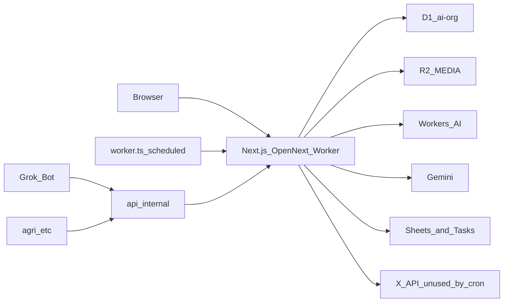

# システムアーキテクチャ

関連: [overview.md](./overview.md) · [database.md](./database.md) · [interfaces.md](./interfaces.md)

コード生成・リファクタ時に逸脱しないためのルールブック。詳細な操作手順は [README.md](../README.md)。

## 1. 全体構成図

- ブラウザは App Router の画面と Server Actions が中心。一部のみ Route Handler（認証、メディア、内部 API、画像解析、文字起こし）。
- Cron は [worker.ts](../worker.ts) の `scheduled`。現状アクティブなのは Google Tasks 同期（10分）。X API 投稿 Cron は no-op。
- 内部 API（`/api/internal/*`）はセッションではなく共有シークレット。

## 2. 技術スタック

- **Frontend**: Next.js 16 App Router、React 19、Tailwind CSS 4、TypeScript 5
- **Backend**: 同じ Next.js（Server Actions + Route Handlers）。別言語の API サーバはない
- **Hosting**: Cloudflare Workers + OpenNext（`@opennextjs/cloudflare`）
- **DB**: Cloudflare D1（SQLite、binding `DB`、database `ai-org`）。ORM なし、生 SQL
- **画像**: Cloudflare R2（binding `MEDIA`、bucket `ai-org-media`）、Cloudflare Images（binding `IMAGES`）
- **Auth**: アプリ内パスワード + `jose` HS256 JWT Cookie（`ai-org-session`）
- **AI**: Workers AI（文字起こし等）、Gemini（X 投稿画像解析）
- **外部**: Google Sheets、Google Tasks、X API（Cron からは未使用）

バインディング正本は [wrangler.jsonc](../wrangler.jsonc)。KV / Queues / Durable Objects / Vectorize は使っていない。

## 3. 設計方針・コーディング規約

### ディレクトリ構造の役割

| パス | 役割 |
|---|---|
| `src/app/` | 画面、`actions.ts`（`"use server"`）、`api/` |
| `src/components/` | UI。Server Action を呼ぶ Client Components |
| `src/lib/` | D1/R2、認証、同期、型、自動化カタログ |
| `src/middleware.ts` | セッション検証。localhost はスキップ |
| `worker.ts` | OpenNext `fetch` 委譲 + Cron |
| `migrations/` | D1 スキーマの正本 |
| `docs/` | 仕様書。`VERSION.md` は変更履歴（別ルール） |

### 状態管理の原則

- Redux / Zustand / TanStack Query は使わない。
- 読み取り: RSC が Server Actions を呼び、props で Client へ渡す。
- 書き込み: `"use server"` + `useTransition`。更新後は `revalidatePath`。
- ページは `dynamic = "force-dynamic"` を前提にする。
- DB は `getCloudflareContext()` → `env.DB`（[src/lib/db.ts](../src/lib/db.ts)）。ID は `prefix_uuid`。

### エラーハンドリング・ロギング

- ユーザー向けは `{ error: string }` または HTTP 500。詳細は `console.error`。
- ルートエラー境界は `src/app/error.tsx`。
- Cron の成否は `recordAutomationRun` で D1 に残す。
- 集中ログ基盤（Sentry 等）は導入しない（現状維持）。

### 逸脱禁止（承認なしでやらない）

- Prisma / Drizzle など ORM の追加。
- Cloudflare Access との二重認証。
- KV / Durable Objects / Queues の無断追加。
- 公開会員登録・Stripe 課金など、社内ツールから外れる認証・課金モデル。
- UI/CSS（レイアウト、色、フォント、間隔）の無断変更。
