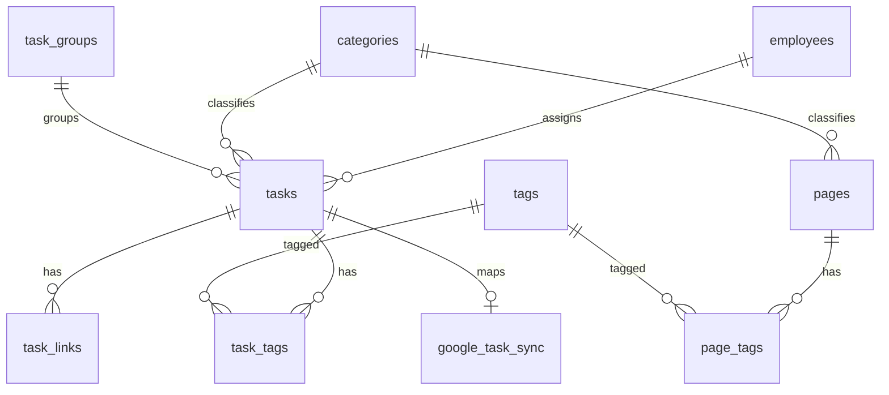
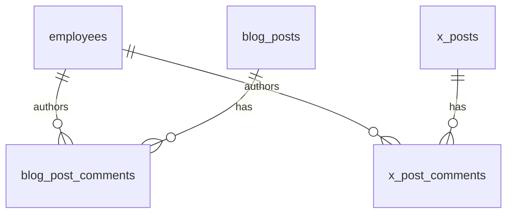
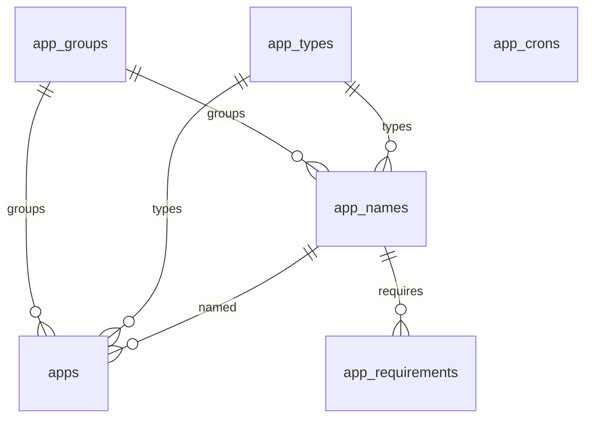
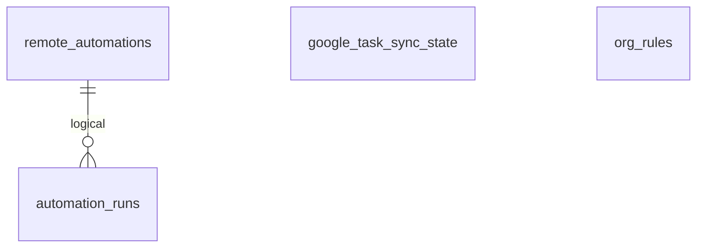

# データモデル設計

関連: [overview.md](./overview.md) · [architecture.md](./architecture.md) · [interfaces.md](./interfaces.md)

正本は `migrations/*.sql`（Cloudflare D1 = SQLite）。最新は `0038_x_post_comments.sql`。型の要約は [src/lib/types.ts](../src/lib/types.ts)。ORM / Prisma はない。

テーブル数は 24。日時は TEXT（`datetime('now')` / ISO）。ID はアプリ側で `prefix_uuid`。

## 1. ER図

### 業務台帳

`tasks.recurrence_series_id` は同一シリーズの論理グループで、自己参照 FK はない。

### X・ブログ

Sheets 同期は D1 外（後述）。

### App 管理

`app_crons` に apps への FK はない。

### 自動化

`automation_runs` から `remote_automations` への宣言 FK はない。`org_rules` は独立。

## 2. 主要エンティティ定義

### 組織・業務

- **employees**: AI従業員。`name`, `role`, `area`, `authority`, 色、`sort_order`。
- **categories** / **tags** / **task_groups**: 分類マスタ。
- **tasks**: 業務タスク。`status` は `draft` / `approved` / `scheduled` / `done` / `failed`。期間は `start_at` / `end_at`。
- **task_tags** / **task_links**: タスクのタグと関連 URL。
- **pages** / **page_tags**: アプリ内ページ台帳。
- **org_rules**: 組織ルール。職務権限表の固定 id は `rule-authority-matrix`。

`tasks` にはレガシー列 `scheduled_at`, `x_post_id`, `last_error` が残るが、アプリの INSERT / 型では未使用（X は `x_posts` へ分離済み）。

### X投稿・ブログ

- **x_posts**: 投稿文・画像キー・予約。`destination` は `studiofoods`（既定）/ `agri`。
- **x_post_comments**: 投稿済以外の X 投稿への AI コメント。1記事に複数AI・複数件。`employee_id` は任意（AI従業員）。`status` は `open`（未対応）/ `done`（対応済）。投稿済（`done`）への投入は拒否。
- **blog_posts**: 公式ブログ下書き。`status` は `draft` / `approved` / `published` / `rejected`。`destination` は `studiofoods_hp` / `agri_lp`。`category` / `tags` はマスタ FK ではなく TEXT。画像は `thumbnail_key` と `figure_keys`（JSON）。
- **blog_post_comments**: 未公開下書きへの AI コメント。1記事に複数AI・複数件。`employee_id` は任意（AI従業員）。`status` は `open`（未対応）/ `done`（対応済）。公開済への投入は拒否。

### App 管理

- **app_groups** / **app_types** / **app_names**: マスタ。`app_names` は FK に加え TEXT の冗長カラム（`app_group`, `app_type`）を持つ。
- **apps**: デプロイ先・スタックメモ（`dev_folder`, `frontend`, `db`, URL 等）。同様に TEXT 冗長カラムあり。
- **app_crons**: Cron 登録（論理的に App 関連、FK なし）。
- **app_requirements**: App 名に紐づく要件。`status` は `draft` / `approved` / `in_progress` / `done` / `cancelled`。

### 自動化・Google Tasks

- **remote_automations**: 複合 PK `(source, id)`。`runner` は `program` / `cursor` / `manual`。
- **automation_runs**: 実行履歴。
- **google_task_sync**: `tasks.id` ↔ Google Task。`last_source` は `ai-org` / `google`。
- **google_task_sync_state**: 行は `id='default'` のみ。OAuth リフレッシュトークンを保持。

## 3. Google Sheets（D1 外）

定数は [src/lib/bulletin-board.ts](../src/lib/bulletin-board.ts)、[src/lib/x-post-sheets-sync.ts](../src/lib/x-post-sheets-sync.ts)、[src/lib/spark-sheet-sync.ts](../src/lib/spark-sheet-sync.ts)。

| 用途 | 定数 | D1 との関係 |
|---|---|---|
| X投稿転記 | `X_POST_SHEET_ID` | `x_posts` と双方向 |
| ブログ投稿管理（SF HP） | `STUDIOFOODS_HP_BLOG_SHEET_ID` | `blog_posts`（`studiofoods_hp`）と同期 |
| ブログ投稿管理（Agri LP） | `AGRI_LP_BLOG_SHEET_ID` | `blog_posts`（`agri_lp`）と同期 |
| ブログネタ | `BLOG_IDEAS_SHEET_ID` | D1 テーブルなし。タブ SideBusiness / Agri |
| Spark 自動化 | `SPARK_SHEET_ID` | 行 → `remote_automations`（`source=spark`） |
