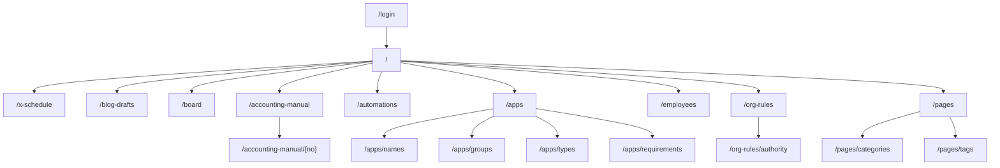

# インターフェース仕様

関連: [overview.md](./overview.md) · [architecture.md](./architecture.md) · [database.md](./database.md)

OpenAPI / Swagger は無い。画面は App Router、更新の大半は Server Actions（[src/app/actions.ts](../src/app/actions.ts)）。

## 1. 画面一覧・遷移フロー

ナビ正本は [src/lib/app-nav.ts](../src/lib/app-nav.ts)。`/login` 以外でトップナビを出す。トップレベルの「情報」はドロップダウン（サイドメニューでは見出し）で、小要素は掲示板・会計マニュアル。「組織」はドロップダウン（サイドメニューでは見出し）で、小要素は従業員・組織ルール・自動化一覧。

| パス | 画面 | ナビ |
|---|---|---|
| `/login` | パスワードログイン | なし |
| `/` | 業務台帳（カレンダー / ガント / 看板）。Google Tasks OAuth callback もここ | トップ |
| `/x-schedule` | X投稿スケジュール | トップ |
| `/blog-drafts` | ブログ下書きの確認・承認＋ネタ参照（SideBusiness / Agri） | トップ |
| `/board` | 掲示板（シートリンク、VERSION 履歴） | トップ（情報） |
| `/accounting-manual` | 会計マニュアル目次（法人税決算・申告 No.1〜62） | トップ（情報） |
| `/accounting-manual/[no]` | 会計マニュアルの各項目（No.1〜62）。前後の項目と目次へ移動可 | 情報 |
| `/automations` | 自動化カタログ / Spark / App Cron | トップ（組織） |
| `/apps` | App リスト | トップ（App管理） |
| `/apps/names` | App 名マスタ | App サブタブ |
| `/apps/groups` | AppGroup マスタ | App サブタブ |
| `/apps/types` | AppType マスタ | App サブタブ |
| `/apps/requirements` | App 要件定義 | App サブタブ |
| `/employees` | AI従業員マスタ | トップ（組織） |
| `/org-rules` | 組織ルール一覧 | トップ（組織） |
| `/org-rules/authority` | 職務権限表 | 組織ルール サブタブ |
| `/pages` | ページ台帳 | トップ |
| `/pages/categories` | カテゴリマスタ | ページ サブタブ |
| `/pages/tags` | タグマスタ | ページ サブタブ |
| `/task-groups` | タスクグループマスタ | ナビ外 |
| `/categories` | `/pages/categories` へリダイレクト | — |
| `/tags` | `/pages/tags` へリダイレクト | — |

ログアウトは `/api/auth/logout`。

### 権限ごとのアクセス制御

ロール別 ACL はない。社内共有パスワード 1 本。

- **本番ホスト**: JWT Cookie `ai-org-session`（httpOnly、SameSite=lax、最大 30 日）。未ログインは `/login?next=…`。
- **localhost / 127.0.0.1**: 認証スキップ（[src/middleware.ts](../src/middleware.ts)）。
- **`/api/internal/*`**: セッション対象外。`Authorization: Bearer` または `x-automation-ingest-secret` で `AUTOMATION_INGEST_SECRET` を検証。
- 認証シークレット未設定の本番は 500（`Auth configuration missing`）。
- Cloudflare Access は使わない（二重認証になる）。

## 2. API仕様

### Route Handlers

| メソッド | パス | 概要 | 認証 |
|---|---|---|---|
| `POST` | `/api/auth/login` | パスワード検証 → セッション Cookie | なし（middleware バイパス） |
| `GET` / `POST` | `/api/auth/logout` | セッション削除 → `/login` | セッション |
| `GET` | `/api/link-preview` | URL の OGP 取得 | セッション |
| `POST` | `/api/transcribe` | 音声文字起こし（Workers AI、≤5MB） | セッション |
| `GET` | `/api/media/[...key]` | R2 メディア配信 | セッション |
| `POST` | `/api/x-post/analyze-image` | 画像から X 投稿文を提案（Gemini） | セッション |
| `POST` | `/api/internal/automation-ingest` | 外部アプリから自動化カタログを push | ingest secret |
| `GET` | `/api/internal/requirements` | 承認済み App 要件を Markdown export | ingest secret |
| `GET` / `POST` | `/api/internal/blog-drafts` | ブログ下書きの一覧 / 外部投入 | ingest secret |
| `GET` / `POST` | `/api/internal/spark-automations` | Spark 自動化の取得 / シート pull | ingest secret |

要件 export のクエリと手順: [cursor-automation-app-requirements.md](./cursor-automation-app-requirements.md)。

### Server Actions（要約）

正本は [src/app/actions.ts](../src/app/actions.ts)。ドメイン単位の CRUD が中心。

| ドメイン | 主な操作 |
|---|---|
| Employees / Categories / Tags / Task groups / Pages | list / create / update / delete（Employees は reorder あり） |
| Org rules | list / get / create / update / body 更新 / delete |
| Tasks | list / create / update / status / delete |
| X posts | list / create / update / status / delete / Sheets 同期 / 予約分投稿 / 即時投稿 |
| Google Tasks | 今すぐ同期 / 最終実行の取得 / OAuth 完了（全リスト取得、新規はリスト ai-org） |
| Spark | シートから再取得 |
| App names / groups / types / apps / crons / requirements | list / create / update / reorder / delete |
| Blog | list / create / update / status / delete / 投稿先シート同期 |

即時 X 投稿や「予約分をいま投稿」は Server Action から呼べるが、毎分 Cron の X API 投稿は停止中。
