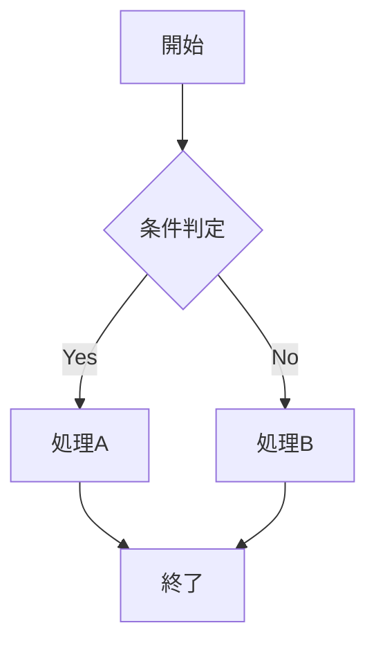
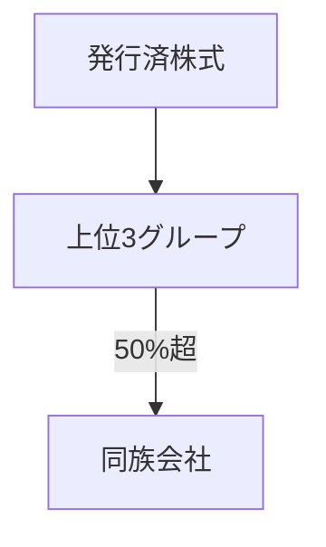

# 会計マニュアル コンテンツ

このディレクトリには、会計マニュアルページ (`/accounting-manual`) で表示されるコンテンツファイルを格納します。

## ファイル構成

- `toc.json`: 全62項目の目次データ (No., タイトル, 概要, ページ範囲)
- `no-01.md`, `no-02.md`, ..., `no-62.md`: 各項目の詳細コンテンツ (Markdown形式)

## コンテンツの追加方法

### 1. 新しい項目のMarkdownファイルを作成

ファイル名は `no-XX.md` の形式で、番号は2桁のゼロパディング (例: `no-01.md`, `no-15.md`, `no-62.md`)

### 2. Markdownフォーマット

以下の要素がサポートされています:

#### 見出し

```markdown
# 大見出し (H1)
## 中見出し (H2)
### 小見出し (H3)
```

#### リスト

```markdown
- 箇条書き1
- 箇条書き2

1. 番号付きリスト1
2. 番号付きリスト2
```

#### 表

```markdown
| 列1 | 列2 | 列3 |
|---|---|---|
| データ1 | データ2 | データ3 |
| データ4 | データ5 | データ6 |
```

表は横スクロール可能なコンテナ内に自動的に配置されます。

#### 引用

```markdown
> 引用文です。
> 複数行にわたって記述できます。
```

#### コードブロック

````markdown
```
コードやテキストをそのまま表示
```
````

#### Mermaid ダイアグラム

Mermaidを使用してフローチャートなどのダイアグラムを描画できます:

````markdown

````

サポートされているMermaidダイアグラムタイプ:
- `flowchart` / `graph`: フローチャート
- `sequenceDiagram`: シーケンス図
- `classDiagram`: クラス図
- `stateDiagram`: 状態遷移図
- `erDiagram`: ER図
- `gantt`: ガントチャート
- `pie`: 円グラフ
- `journey`: ユーザージャーニー

### 3. 画像の追加 (オプション)

スキャン画像などを追加する場合は、`/public/accounting-manual/` ディレクトリに画像ファイルを配置し、Markdown内で参照します:

```markdown

```

## 例: no-01.md の構造

```markdown
# No.1 同族会社を判定する ―別表2―

> 同族会社・特定同族会社の判定をするために、株主の持株数や親族関係等を把握する必要があります。  
> (出典ページ: 2〜5)

## STEP 1　株主名簿を整理する

1. 株主名簿は、同族会社の判定や役員の構成・同族関係等を把握するための基本データです。
2. 氏名・住所・役職名・異動の状況・持株数(議決権数)などを記載します。

### 例: 株主名簿

| 氏名 | 持株数 | 割合 |
|---|---:|---:|
| 山田 太郎 | 126 | 63% |
| 山田 花子 | 34 | 17% |

## STEP 3　判定フロー


```

## 自動表示の仕組み

`/accounting-manual` ページは、以下の処理を自動的に行います:

1. `toc.json` から全項目の目次を読み込む
2. 章ごとにグループ化してTOCテーブルを表示
3. `no-XX.md` ファイルが存在する項目については、TOCの下に詳細コンテンツを展開表示
4. アンカーリンク `#no-1`, `#no-2`, ... で各項目に直接ジャンプ可能

新しいMarkdownファイルを追加するだけで、ページに自動的に反映されます (サーバー再起動不要)。
